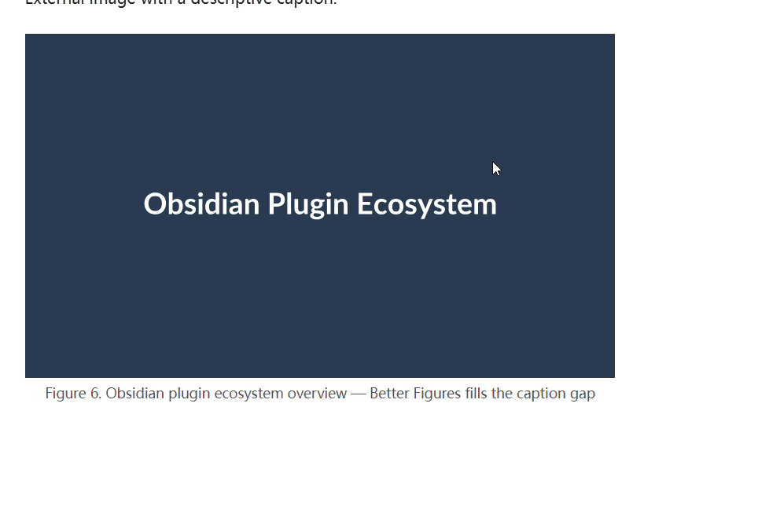

# Better Figures

Add captions to images using native Markdown syntax.



## Features

- **Native Markdown syntax** — write `` and the alt text becomes a centered caption below the image.
- **Reading view** — captions rendered via Obsidian's Markdown post-processor.
- **Live Preview** — captions rendered with pure CSS, even while editing.
- **Empty alt text** — images like `` are left unchanged, so existing notes are unaffected.
- **Image embeds** — works with both external images and internal `![[image]]` embeds.
- **Lightweight** — zero dependencies at runtime, no settings needed.

## Usage

Write a standard Markdown image:

```markdown

```

In both Reading view and Live Preview, Better Figures renders the image with the caption centered below it.

Images with empty alt text are left as-is:

```markdown

```

## Installation

### From Community Plugins (recommended)

1. Open Obsidian and go to **Settings → Community plugins**.
2. Disable **Restricted mode** if prompted.
3. Click **Browse** and search for "Better Figures".
4. Install and enable the plugin.

### Manual

1. Download the latest release from [GitHub Releases](https://github.com/SunnyYYLin/better-figures/releases).
2. Copy `main.js`, `manifest.json`, and `styles.css` into `<vault>/.obsidian/plugins/better-figures/`.
3. Enable the plugin in **Settings → Community plugins**.

## Development

```bash
bun install
bun run dev
```

Build for release:

```bash
bun run build
```

## License

BSD-0-Clause License
